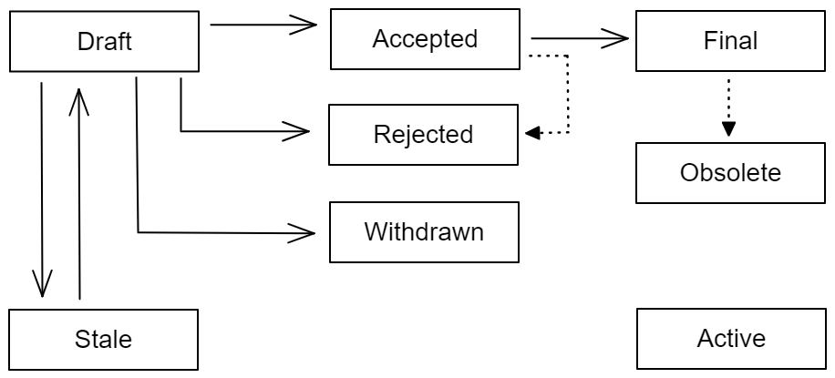

<pre>
TIP: 1
Title: TIP Purpose, Specification, and Process
Author: Nicholas Edmonds <n.edmonds@topl.me>
Status: Proposed
Type: Process
Created: 2022-07-20
License: CC-BY-4.0
</pre>

## Abstract
TIP refers to Topl Improvement Proposals, a formal design process for producing documents and specifications intended to add to the implementation of features or standards found in the Topl ecosystem. 

## Specification

### TIP Components and format

| Section                 | Description                                                                                                                                                                                                                                                                                              |
| ----------------------- | -------------------------------------------------------------------------------------------------------------------------------------------------------------------------------------------------------------------------------------------------------------------------------------------------------- |
| Preamble                | A header containing metadata pertaining to the TIP.                                                                                                                                                                                                                                                      |
| Abstract                | A short (~200 word) description of the technical issue being discussed.                                                                                                                                                                                                                                  |
| Motivation              | A clear explanation of why the TIP is needed and what problem it is attempting to address.                                                                                                                                                                                                               |
| Specification           | The technical specification of the new feature or standard. Include detailed steps and implementation specifics, as well as any standards or other specifications the TIP must adhere to. This should be detailed enough to allow for alternative implementations to be created from this specification. |
| Backwards Compatibility | Specify all breaking changes to any API or existing standard. Any backwards incompatibilities must describe their severity, and any backwards compatibility considerations should be clearly communicated here.                                                                                          |
| Copyright               | A license must be included with the TIP specifying its inclusion into the public domain or protections of code. |

### TIP Status

All proposals once included in the repo will be assigned a number and given the initial status of "Draft". 

| Status    | Description                                                                                                                                                                                                                               |
| --------- | ----------------------------------------------------------------------------------------------------------------------------------------------------------------------------------------------------------------------------------------- |
| Draft     | The document has been formally accepted to the repository and is actively being worked on.                                                                                                                                                |
| Accepted  | A working draft or reference implementation exists, and the TIP is under discussion or review before being formally included into the Topl ecosystem.                                                                                     |
| Active    | The proposed document has been properly evaluated and deemed to be in a complete state for the standard or process. This applies to TIPs meant for informational or documentation purposes that lack an implementation, such as this TIP. |
| Final     | After reaching acceptance, the TIP has been successfully implemented and included as a new feature or standard within the Topl ecosystem.                                                                                                 |
| Obsolete  | The document has been superseded by a newer proposal that explicitly obsoletes this TIP.                                                                                                                                                  |
| Rejected  | The TIP has been outright rejected and documented as so to inform future work and proposals.                                                                                                                                              |
| Stale     | Proposals that have been inactive for a length of time will be considered stale. Unless the original owners or authors respond to communication, the proposal will be considered free to be given to new owners.                          |
| Withdrawn | Proposals may be withdrawn by the owner at any time before being accepted or rejected. This will formally remove the document from further consideration. |

## Licensing and Copyright
New TIPs will be accepted under condition that a license is provided. The license must be specified in the preamble after the "Created" property.

#### Recommended license
* for software: [Apache License, version 2.0][apache] - Apache-2.0
* for documentation: [Creative Commons Attribution 4.0 International License][cc-by] - CC-BY-4.0

## Copyright

This work is licensed under a
[Creative Commons Attribution 4.0 International License][cc-by].

[cc-by]: https://creativecommons.org/licenses/by/4.0/
[apache]: https://www.apache.org/licenses/LICENSE-2.0