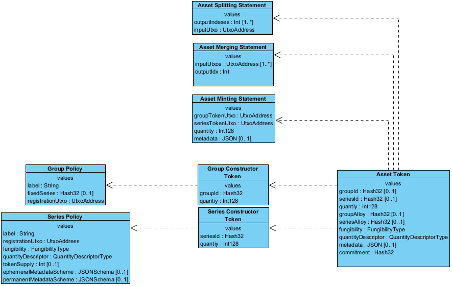

<pre>
TIP: 3
Title: Topl Asset Management v2
Author: Edmundo López Bóbeda <e.lopez@topl.me>
Status: Draft
Type: Standard
Created: 2023-08-02
License: CC-BY-4.0
</pre>

[TOC]

## Abstract

This TIP proposes a specification for the asset management in the TOPL Blockchain.

## Motivation

Core developers and stakeholders of the chain need to understand the inner workings of the TOPL Asset Management Model.

## Specification

### Introduction

The purpose of the Topl Asset Management Specification is to describe custom token implementation on the Topl Blockchain. Some of the design objectives are:

- Allow for tokens that mimic ERC-20 tokens.
- Allow for tokens that mimic ERC-721 NFTs.
- Go beyond ERC-20 and ERC-721 and provide new primitives

The Topl blockchain uses an UTXO model and the rest of this document assumes the tokens work on a UTXO based platform.

### Data Model

We show the data model for the asset model in the following diagram. In the diagram, each block represents a domain entity. Inside the blocks are the entities' attributes followed by their types. Finally, the dashed arrows represent that there is a dependency relation between the entities. 

The diagram assumes the existence of the following value types, which are used to type the attributes:

- **Int.-** A 32-bit integer.

- **Int128.-** A 128 bit unsigned integer.

- **Hash32.-** A 32 bytes long message digest.

- **FungibilityType.-** It has 3 values:

  - `group-and-series`
  - `series`
  - `group`

  `group-and-series` means that both the series and the group are considered for fungibility. `series` means that only the series is considered for fungibility. `group` means that only the group is considered for fungibility

- **QuantityDescriptorType.-** It has 4 possible values:

  - `standard`
  - `accumulator`
  - `fractionable`
  - `immutable`

  `standard` means that the token has the standard behavior. If it is fungible one can fraction it in smaller tokens or merge two smaller tokens to make a bigger one. `accumulator` means that the token can only be merged with other fungible tokens. Once two tokens are merged they can never be separated and will always share the same UTXO. `fractionable` means that the token can only be split but not merged with other fungible tokens. Once the token was split it can never be put together again. `immutable`  means that a token can neither be accumulated nor split, it always keeps the same quantity.

#### Asset Token

Represents the instance of an asset that is stored in a UTXO. We call the pair (groupId, seriesId) the asset identifier.

##### Attributes

| Attribute Name | Type   | Description                                                  |
| -------------- | ------ | ------------------------------------------------------------ |
| groupId        | Hash32 | The group identifier of the group token that was used to mint this asset. |
| seriesId       | Hash32 | The series identifier of the series token that was used to mint this asset. |
| quantity       | Int128 | The quantity of the asset that is stored in a given UTXO.    |

#### Group Constructor Token

The group constructor token is a special type of token whose sole purpose is to be consumed (along a Series Constructor Token) to mint an asset token.  A group constructor token is not different from any token in the sense that it can be transferred as any other token as part of a transaction. Having a group constructor token gives the bearer the possibility to mint a new asset token. Group constructor tokens are also associated to a group policy. A group policy is a file that describes what are the rules that govern a particular group.

##### Attributes

| Attribute Name | Type   | Description                                                  |
| -------------- | ------ | ------------------------------------------------------------ |
| groupId        | Hash32 | The group identifier of this group constructor token. It is the digest of the Group Policy. |
| quantity       | Int128 | The quantity of group constructor tokens stored in a given UTXO. |

#### Series Constructor Token

The series constructor token is a special type of token whose sole purpose is to be consumed (along a Group Constructor Token) to mint an asset token. As group constructor tokens, they have the same properties. Having a series constructor token gives the bearer the possibility to mint a new asset token. Series constructor tokens are associated with a series policy. 

##### Attributes

| Attribute Name | Type   | Description                                                  |
| -------------- | ------ | ------------------------------------------------------------ |
| seriesId       | Hash32 | The series identifier of this series constructor token. It is the digest of the Series Policy. |
| quantity       | Int128 | The quantity of series constructor tokens stored in a given UTXO. |

#### Group Policy

The group policy describes a group of tokens and the behavior of a Group Constructor Token when used in a minting transaction.

##### Attributes

| Attribute Name   | Type        | Description                                                  |
| ---------------- | ----------- | ------------------------------------------------------------ |
| label            | String      | The human readable name of this group.                       |
| registrationUtxo | UtxoAddress | The address of a UTXO. The UTXO contains the LVLs that are paid for minting the group constructor token. |
| fixedSeries      | Hash32      | This is an optional field. When provided, it means that this group can only be used to mint an asset with the series that has the same identifier as this field. |

#### Series Policy

The series policy describes a series of tokens and the behavior of a Series Constructor Token when used in a minting transaction.

##### Attributes

| Attribute Name     | Type                   | Description                                                  |
| ------------------ | ---------------------- | ------------------------------------------------------------ |
| label              | String                 | The human readable name of this series.                      |
| registrationUtxo   | UtxoAddress            | The address of a UTXO. The UTXO contains the LVLs that are paid for minting the group constructor token. |
| tokenSupply        | Int                    | This is an optional field. When provided it fixes the quantity of tokens that can be minted when this series is consumed, and both the group constructor and the series constructor are burned by the minting transaction. When not provided, neither group nor the series constructor are burned, thus making the token supply unlimited. |
| fungibility        | FungibilityType        | Describes the fungibility of the assets minted using the series constructor token derived from this policy. |
| quantityDescriptor | QuantityDescriptorType | Describes the behavior of the quantity field of the assets minted using the series constructor derived from this policy. |

#### Asset Minting Statement

The asset minting provides the information needed at the moment of minting an asset.

##### Attributes

| Attribute Name  | Type        | Description                                                  |
| --------------- | ----------- | ------------------------------------------------------------ |
| groupTokenUtxo  | UtxoAddress | The address of the UTXO that contains the group constructor token that we are using to mint the asset token. |
| seriesTokenUtxo | UtxoAddress | The address of the UTXO that contains the seriesconstructor token that we are using to mint the asset token. |
| quantity        | Int128      | The number of assets that we are minting using the group and series constructor token references by the two other attributes. |

### Minting Process

The minting of an asset requires the previous existence of one Group and one Series Constructor tokens. Depending on the token supply stated in the `tokenSupply` of the policy associated with the series constructor token the tokens might or not be burned at the minting transaction. The steps to mint an asset token are the following:

1. Mint one or several group constructor tokens.
2. Mint one or several series constructor tokens.
3. Mint the asset token corresponding to the group and series constructor token.

#### Minting of Group Constructor Tokens

The minting of a group constructor token requires to burn a certain amount of LVLs and to provide the policy that describes the group. This requires the submission of a minting transaction to the node. To support this kind of transactions, the following validations need to be performed on the transaction:

- *Check Moving Constructor Tokens:* Let `GI1` be a group identifier, then the number of Group Constructor Tokens with group identifier `GI1` in the input is equal to the number of the number of Group Constructor Tokens with identifier `GI1` in the output.
- *Check Minting Constructor Tokens:* Let `GI1` be a group identifier and `GP1` the policy whose digest is equal to `GI1`, all of the following statements are true:
  - The policy `GP1` is attached to the transaction.
  - The number of group constructor tokens with identifier `GI1` in the output of the transaction is strictly bigger than 0.
  - The registration UTXO referenced in `GP1` is present in the inputs and contains LVLs.

#### Minting of Series Constructor Tokens

The minting of a series constructor token requires to burn a certain amount of LVLs and to provide te policy that describes the series. This requires the submission of a minting transaction to the node. To support this kind of transactions, the following validations need to be performed on the transaction:

- *Check Moving Series Tokens:* Let `SI1` be a series identifier, then the number of Series Constructor Tokens with group identifier `SI1` in the input is equal to the number of the number of Series Constructor Tokens with identifier `SI1` in the output.
- *Check Minting Constructor Tokens:* Let `SI1` be a series identifier and `SP1` the policy whose digest is equal to `SI1`, all of the following statements are true:
  - The policy `SP1` is attached to the transaction.
  - The number of series constructor tokens with identifier `SI1` in the output of the transaction is strictly bigger than 0.
  - The registration UTXO referenced in `SP1` is present in the inputs and contains LVLs.

#### Minting of an Asset Token

The minting of an asset requires to use one group and one series constructor token. This requires the submission of a minting transaction to the node. To support this kind of transactions, the following validations need to be performed on the transaction.

- *Check Moving Assets:* Let (`GI1` ,`SI1`) be a token identifier, then the number of tokens with identifier (`GI1` ,`SI1`) in the input is equal to the number of the number of tokens with identifier (`GI1` ,`SI1`) in the output.
- *Check Minting of Asset Tokens:* Let $AMS_1$ ... $AMS_{n}$ be the $n$ Asset Minting Statement to mint $m_1$, $m_2$, ..., $m_{n}$  tokens with identifier  (`GI1` ,`SI1`) , all of the following statements are true:
  - All Asset Minting Statement $AMS_1$ ... $AMS_{n}$  are attached to the transaction.
  - Let $in$ be the number of assets with identifier (`GI1` ,`SI1`) in the input and $out$  number of assets with identifier (`GI1` ,`SI1`) in the output, then: 
    $$in + \sum_{i = 1}^{n - 1} m_i = out$$
  - For each $AMS_i$, all UTXOs referenced are unique.
  - For each $AMS_i$, the token supply specified in the referenced series is equal to the quantity attribute in $AMS_i$.

### Glossary

- UTXO

