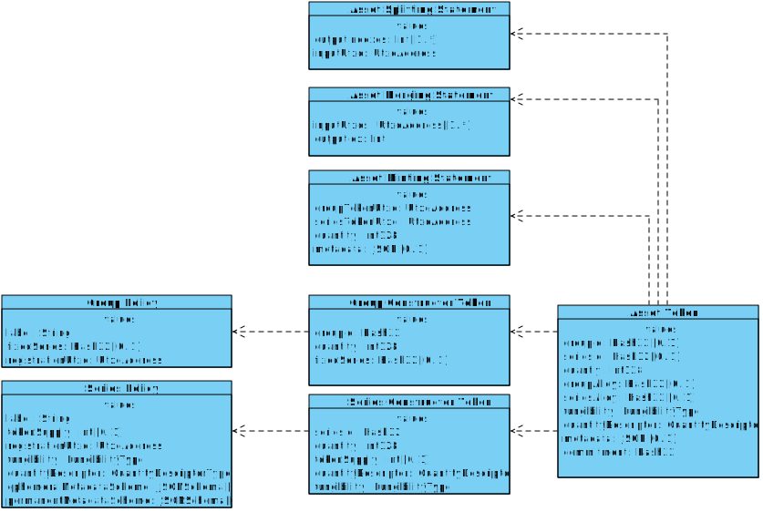

<pre>
TIP: 3
Title: Topl Asset Management v2
Author: Edmundo López Bóbeda <e.lopez@topl.me>
Status: Draft
Type: Standard
Created: 2023-08-02
License: CC-BY-4.0
</pre>

## Abstract

This TIP proposes a specification for the asset management in the Topl Blockchain.

## Motivation

Core developers and stakeholders of the chain need to understand the inner workings of the Topl Asset Management Model.

## Specification

### Introduction

The purpose of the Topl Asset Management Specification is to describe custom token implementation on the Topl Blockchain. Some of the design objectives are:

- Allow for fungible custom assets, similar to ERC-20 tokens.
- Allow for tokens that mimic ERC-721 NFTs.
- Go beyond ERC-20 and ERC-721 and provide new primitives.
- Keep the chain stateless. In particular, sometimes a little data duplication is allowed to avoid global state.

The Topl blockchain uses an UTXO model and the rest of this document assumes the tokens work on a UTXO based platform.

### Data Model

We show the data model for the asset model in the following diagram. In the diagram, each block represents a domain entity. Inside the blocks are the entities' attributes followed by their types. Finally, the dashed arrows represent that there is a dependency relation between the entities. 

The diagram assumes the existence of the following value types, which are used to type the attributes:

- **Int32.-** A 32-bit integer.

- **Int128.-** A 128 bit unsigned integer.

- **Hash32.-** A 32 bytes long message digest.

- **JSON.-** A JSON object.

- **JSONSchema.-** A JSON schema following the [JSON Schema Specification](https://json-schema.org/specification.html).  

- **FungibilityType.-** It has 3 values:

  - `group-and-series`
  - `series`
  - `group`

  `group-and-series` means that both the series and the group are considered for fungibility. `series` means that only the series is considered for fungibility. `group` means that only the group is considered for fungibility. When multiple, distinct, but fungible assets are combined, they are said to form an `alloy` of types.

- **QuantityDescriptorType.-** It has 4 values:

  - `standard`
  - `accumulator`
  - `fractionable`
  - `immutable`

  `standard` means that the token has the standard behavior. If it is fungible one can fraction it in smaller tokens or merge two smaller tokens to make a bigger one. `accumulator` means that the token can only be merged with other fungible tokens. Once two tokens are merged they can never be separated and will always share the same UTXO. `fractionable` means that the token can only be split but not merged with other fungible tokens. Once the token was split it can never be put together again. `immutable`  means that a token can neither be accumulated nor split, it always keeps the same quantity.

In brackets after the types we include (when it applies) the cardinalities of the different values. For example, Int32 [ 0 .. 1 ] represents an optional integer, or Hash32 [ 1 .. * ] a non empty list of Hash32. We borrowed this notation from the SysML modeling language. For more details, the reader can read the section on cardinality in the [SysML Specification](https://www.omg.org/spec/SysML/2.0/Beta1/Language/PDF).

#### Asset Token

Represents the instance of an asset that is stored in a UTXO. We call the pair (groupId, seriesId) the asset identifier. An asset token might have a group alloy or a series alloy, but not both.

##### Attributes

| Attribute Name     | Type                   | Description                                                  |
| ------------------ | ---------------------- | ------------------------------------------------------------ |
| groupId            | Hash32 [ 0 .. 1 ]      | The group identifier of the group token that was used to mint this asset. When there is a groupAlloy this field is not used. |
| seriesId           | Hash32 [ 0 .. 1 ]      | The series identifier of the series token that was used to mint this asset. When there is a seriesAlloy this field is not used. |
| quantity           | Int128                 | The quantity of the asset that is stored in a given UTXO.    |
| groupAlloy         | Hash32 [ 0 .. 1 ]      | This field is optional and represents a Merkle root of the alloy of groups in this asset. This is only valid for tokens that are series fungible. |
| seriesAlloy        | Hash32 [ 0 .. 1 ]      | This field is optional and represents a Merkle root of the alloy of series in this asset. This is only valid for tokens that are group fungible. |
| fungibility        | FungibilityType        | Describes the fungibility of the asset.                      |
| quantityDescriptor | QuantityDescriptorType | Describes the quantity behavior of this asset.               |
| ephemeralMetadata  | JSON [ 0 .. 1 ]        | This is the ephemeral metadata of an asset. It follows the schema defined in the ephemeral metadata schema of the series policy corresponding to the token being minted. The conformance of this field to the schema is not checked by the node. This field is managed by the user. |
| commitment         | Hash32                 | This field is meant to store a commitment in the form of a hash. This field is managed by the user. Metadata concerning this field can be added to the metadata. |

#### Group Constructor Token

The group constructor token is a special type of token whose sole purpose is to be consumed (along with a Series Constructor Token) to mint an asset token.  A group constructor token is not different from any token in the sense that it can be transferred as any other token as part of a transaction. Having a group constructor token gives the bearer the possibility to mint a new asset token. Group constructor tokens are also associated to a group policy. A group policy is a file that describes what are the rules that govern a particular group.

##### Attributes

| Attribute Name | Type   | Description                                                  |
| -------------- | ------ | ------------------------------------------------------------ |
| groupId        | Hash32 | The group identifier of this group constructor token. It is the digest of the Group Policy. |
| quantity       | Int128 | The quantity of group constructor tokens stored in a given UTXO. |

#### Series Constructor Token

The series constructor token is a special type of token whose sole purpose is to be consumed (along a Group Constructor Token) to mint an asset token. Similar to group constructor tokens, they have the same properties. Having a series constructor token gives the bearer the possibility to mint a new asset token. Series constructor tokens are associated with a series policy. 

##### Attributes

| Attribute Name     | Type                   | Description                                                  |
| ------------------ | ---------------------- | ------------------------------------------------------------ |
| seriesId           | Hash32                 | The series identifier of this series constructor token. It is the digest of the Series Policy. |
| quantity           | Int128                 | The quantity of series constructor tokens stored in a given UTXO. |
| tokenSupply        | Int32 [ 0 .. 1 ]       | This is an optional field. When provided it fixes the quantity of tokens that will be minted when this series is consumed, and the series constructor is burned by the minting transaction. When not provided, the series constructor is not burned, thus making the token supply unlimited. |
| fungibility        | FungibilityType        | Describes the fungibility of the assets minted using this series constructor token. |
| quantityDescriptor | QuantityDescriptorType | Describes the behavior of the quantity field of the assets minted using the series constructor derived from this policy. |

#### Group Policy

The group policy describes a group of tokens and the behavior of a Group Constructor Token when used in a minting transaction.

##### Attributes

| Attribute Name   | Type             | Description                                                  |
| ---------------- | ---------------- | ------------------------------------------------------------ |
| label            | String           | The human readable name of this group.                       |
| registrationUtxo | UtxoAddress      | The address of a UTXO. The UTXO contains the LVLs that are paid for minting the group constructor token. |
| fixedSeries      | Hash32 [ 0 .. 1] | This is an optional field. When provided, it means that this group can only be used to mint an asset with the series that has the same identifier as this field. |

#### Series Policy

The series policy describes a series of tokens and the behavior of a Series Constructor Token when used in a minting transaction.

##### Attributes

| Attribute Name          | Type                   | Description                                                  |
| ----------------------- | ---------------------- | ------------------------------------------------------------ |
| label                   | String                 | The human readable name of this series.                      |
| registrationUtxo        | UtxoAddress            | The address of a UTXO. The UTXO contains the LVLs that are paid for minting the series constructor token. |
| tokenSupply             | Int32 [ 0 .. 1 ]       | This is an optional field. When provided it fixes the quantity of tokens that can be minted when this series is consumed, and the series constructor is burned by the minting transaction. When not provided, the series constructor is not burned, thus making the token supply unlimited. |
| fungibility             | FungibilityType        | Describes the fungibility of the assets minted using the series constructor token derived from this policy. |
| quantityDescriptor      | QuantityDescriptorType | Describes the behavior of the quantity field of the assets minted using the series constructor derived from this policy. |
| ephemeralMetadataScheme | JSONSchema [ 0 .. 1 ]  | Describes the schema of the data stored in the metadata field of the Asset Minting Statement. |
| permanentMetadataScheme | JSONSchema [ 0 .. 1 ]  | Describes the schema of the data stored in the Asset Token.  |

#### Asset Minting Statement

The asset minting statement provides the information needed at the moment of minting an asset.

##### Attributes

| Attribute Name    | Type            | Description                                                  |
| ----------------- | --------------- | ------------------------------------------------------------ |
| groupTokenUtxo    | UtxoAddress     | The address of the UTXO that contains the group constructor token that we are using to mint the asset token. |
| seriesTokenUtxo   | UtxoAddress     | The address of the UTXO that contains the seriesconstructor token that we are using to mint the asset token. |
| quantity          | Int128          | The number of assets that we are minting using the group and series constructor token references by the two other attributes. |
| permanentMetadata | JSON [ 0 .. 1 ] | This is the permanent metadata of an asset. It follows the schema defined in the permanent metadata schema of the series policy corresponding to the token being minted. The conformance of this field to the schema is not checked by the node. |

#### Asset Merging Statement

The asset merging statement provides the information needed at the moment of merging an asset.

##### Attributes

| Attribute Name | Type                  | Description                                                  |
| -------------- | --------------------- | ------------------------------------------------------------ |
| inputUtxos     | UtxoAddress [1 .. * ] | The non-empty list of UTXOs that we are using to compute the Merkle root for the alloy. |
| outputIdx      | Int32                 | The index in the output sequence of the transaction where the merged tokens are stored. |

#### Asset Splitting Statement

The asset splitting statement provides the information needed at the moment of splitting an asset.

##### Attributes

| Attribute Name | Type            | Description                                                  |
| -------------- | --------------- | ------------------------------------------------------------ |
| outputIndexes  | Int32 [1 .. * ] | The non-empty list of indexes where the split asset is being put. |
| inputUtxo      | UtxoAddress     | The UTXO that is being split.                                |

### Minting Process

The minting of an asset requires the previous existence of one Group and one Series Constructor tokens. Depending on the token supply stated in the `tokenSupply` of the policy associated with the series constructor token the tokens might or not be burned at the minting transaction. The steps to mint an asset token are the following:

1. Mint one or several group constructor tokens.
2. Mint one or several series constructor tokens.
3. Mint the asset token corresponding to the group and series constructor token.

#### Minting of Group Constructor Tokens

The minting of a group constructor token requires to burn a certain amount of LVLs and to provide the policy that describes the group. This requires the submission of a minting transaction to the node. To support this kind of transactions, the following validations need to be performed on the transaction:

- *Check Moving Constructor Tokens:* Let $g$ be a group identifier, then the number of Group Constructor Tokens with group identifier $g$ in the input is equal to the quantity of Group Constructor Tokens with identifier $g$ in the output.
- *Check Minting Constructor Tokens:* Let $g$ be a group identifier and $p$ the group policy whose digest is equal to $g$, a transaction is valid only if the all of the following statements are true:
  - The policy $p$ is attached to the transaction.
  - The number of group constructor tokens with identifier $g$ in the output of the transaction is strictly bigger than 0.
  - The registration UTXO referenced in $p$ is present in the inputs and contains LVLs.

#### Minting of Series Constructor Tokens

The minting of a series constructor token requires to burn a certain amount of LVLs and to provide te policy that describes the series. This requires the submission of a minting transaction to the node. To support this kind of transactions, the following validations need to be performed on the transaction:

- *Check Moving Series Tokens:* Let $s$ be a series identifier, then the number of Series Constructor Tokens with group identifier $s$ in the input is equal to the number of the number of Series Constructor Tokens with identifier $s$ in the output.
- *Check Minting Constructor Tokens:* Let $s$ be a series identifier and $p$ the series policy whose digest is equal to $s$, all of the following statements are true:
  - The policy $p$ is attached to the transaction.
  - The number of series constructor tokens with identifier $s$ in the output of the transaction is strictly bigger than 0.
  - The registration UTXO referenced in $p$ is present in the inputs and contains LVLs.

#### Minting of an Asset Token

The minting of an asset requires to use one group and one series constructor token. This requires the submission of a minting transaction to the node. To support this kind of transactions, the following validations need to be performed on the transaction.

- *Check Minting of Asset Tokens:* Let $A_0$ ... $A_{n-1}$ be the $n$ Asset Minting Statements to mint $m_0$, $m_1$, ..., $m_{n-1}$  tokens with identifier  ($g$, $s$) , all of the following statements are true:
- All Asset Minting Statements $A_0$ ... $A_{n-1}$  are attached to the transaction.
  
- Let $in$ be the number of assets with identifier ($g$, $s$) in the input and $out$  number of assets with identifier ($g$, $s$) in the output, then: 

$$
in + \sum_{i = 1}^{n - 1} m_i = out
$$

  - For all $A_i$, all UTXOs referenced are distinct.

  - For all $A_i$, the token supply specified in the referenced series is equal to the quantity attribute in $A_i$.

  - Let $sin$ be the total number of series constructor tokens with identifier $s$ in the input, $sout$ the total number of series constructor tokens with identifier $s$ in the output, and $burned$ the number of $A_i$ where the referenced series specifies a token supply, then we have:

$$
sin - burned = sout
$$

### Transacting with Assets

Transaction with assets are performed in the same way as transactions with LVLs. The only difference is that assets allow for different degrees of fungibility. At a chain level, two assets are fungible if they can both be stored in the same UTXO. This poses a problem when we deal with two assets that are fungible at one level but not at the other. 

#### Moving Assets

Moving assets does not require to attach any extra metadata to the transaction. Each time an asset is moved, it is the user's responsibility to populate (if desired) both the metadata and commitment field. _It is also responsibility of the user to ensure that the metadata conforms to the data specification in the policy_. The node does not enforce this. The following validations are performed by the node:

- *Check Assets Fungibility:* Let $g$ be a group identifier and $s$, $s_0$, ..., $s_{n - 1}$  be series identifiers,  all of the following statements must be true:
  - if $s$ is group and series fungible, then the number of tokens with identifier ($g$, $s$) in the input is equal to the number of tokens with identifier ($g$, $s$) in the output.
  
  - if $s$ is a series fungible series, and $G$ the set of group identifiers, then the sum of all tokens with identifiers ($g$, $s$), where $g \in G$, in the input is equal to the number of tokens with identifiers ($g$, $s$), where $g \in G$.
  
  - if $g$ is a group identifier and $S$ is the set of group fungible series, then the sum of all tokens with identifiers ($g$, $s$), where $s\in S$, in the input is equal to the number of tokens with identifier ($g$, $s$), where $s\in S$.
  
- *Check Assets Quantity Descriptors*: Quantity descriptors regulate how UTXOs of an asset are split or merged. This is different from alloys, as the assets being merged or split always share the same group and series identifier. Let ($g$, $s$) be an asset identifier, all the following statements must be true:
  - If  ($g$, $s$)'s quantity descriptor is `immutable`, then, for each input UTXO containing  ($g$, $s$) with quantity $n$ , there must be exactly one output containing  ($g$, $s$) with quantity $n$.
  - If  ($g$, $s$)'s quantity descriptor is `accumulator`, then, for each input UTXO containing  ($g$, $s$) with quantity $n$ , there exists at least one output containing  ($g$, $s$) with quantity  $m \geq n$ .
  - If  ($g$, $s$)'s quantity descriptor is `fractionable`, then, for each input UTXO containing  ($g$, $s$) with quantity $n$ ,  one or more outputs containing  ($g$, $s$) whose sum is equal to $n$.

#### Merging Assets

Merging assets mean that we take two (or more) assets that are fungible at one level but not the other and merge them into the same UTXO.  This requires the submission of a merging transaction to the node. To support this kind of transactions, the following validations need to be performed on the transaction.

- *Check merging assets:* Let $A$ be a Asset Merging Statement to merge UTXOs $u_0$, $u_1$, ..., $u_{n-1}$ into index $i$. All the following statements are true:
  - *All UTXOs share the same fungibility type:* There is a fungibility type $ft$, s.t. for all $u_i$, the fungibility type of $u_i$ is $ft$.
  - *All UTXOs share the same quantity descriptor:*  There is a quantity descriptor $qd$, s.t. for all $u_i$, the quantity descriptor of $u_i$ is $qd$.
  - The asset created at index $i$ has a seriesAlloy if the assets are group fungible, or a groupAlloy if the assets are series fungible. Besides the actual groups or series, the Merkle tree also considers the quantity of each series or group in the alloy. To simplify the Merkle tree and to guarantee a certain uniformity in the trees, we order UTXOs in lexicographical order.
  - The Merkle root in the merged asset corresponds to the values in the input UTXOs.

#### Splitting Assets

Splitting assets is the opposite of merging them.  This requires the submission of a splitting transaction to the node. To support this kind of transactions, the following validations need to be performed on the transaction.

- *Check splitting assets:* Let $A$ be a Asset Splitting Statement to split UTXO $u$ into indexes $i_0$, .., $i_{n - 1}$ . All the following statements are true:
  - All outputs of the transaction have the same fungibility type as the one in the original UTXO $u$.
  - All outputs of the transaction have the same quantity descriptor as the one in the original UTXO $u$.
  - The Merkle root in the split asset corresponds to the values in each output of the transaction.

## Backwards Compatibility

The new asset model is not compatible with the Dion network.

## Copyright

We license this work under a [Creative Commons Attribution 4.0 International License](https://creativecommons.org/licenses/by/4.0/).

