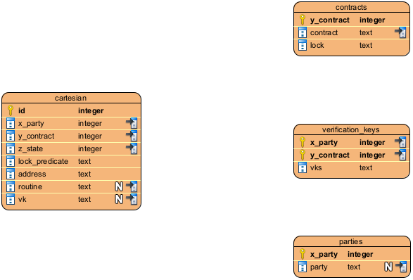

<pre>
TIP: 4
Title: Wallet
Author: Edmundo López Bóbeda <e.lopez@topl.me>
Status: Draft
Type: Standard
Created: 2023-08-08
License: CC-BY-4.0
</pre>
[TOC]


## Abstract

This TIP proposes a specification for the wallet in the TOPL Blockchain.

## Motivation

The Topl Blockchain aims to increase the security of transactions. Dion, the previous incarnation of the Topl blockchain, used the Ed25519 algorithm. It generated a main key pair that was used for all transactions. The Dion implementation computed the blockchain address of a wallet directly from the main verification key. It then fixed this address as the wallet's address.

However, reusing the same key pair several times is not a good security practice. A solution to this problem is to generate several key pairs and use them to generate new addresses as needed. This approach requires constant and space consuming backups of the wallet.

To solve this problem, there are proposals, such as [BIP-32](https://github.com/bitcoin/bips/blob/master/bip-0032.mediawiki). This proposal describes a standard for Hierarchical Deterministic Wallets (HD Wallets). HD wallets use one main key but derive keys in a deterministic way to avoid reuse. This reduces the need to back up, as only the main key needs to be backed up.

BIP-32 is, however, not enough for the Topl Blockchain. Indeed, the Topl Blockchain builds its addresses not only from the verification keys. It builds addresses from the Quivr contracts (which might or might not use a verification key). This implies that the wallet needs more storage than just the keys. Indeed, for each address it owns, a wallet needs to store:

- the Quivr contract that was used to create the contract,
- the public keys of all the participants in the contract,
- the private key or the indices to derive it from the main key to unlock its part of the contract (if there are multiple participants).

Given those requirements, we need to develop a way to both store the information and allow users to look it up without needing to input it each time they need it.

## Specification

This specification is organized as follows. First we present the scope of the specification. Then we formally define what is a wallet. Finally, we present the default implementation of the wallet.

### Scope

We limit this specification to the wallet only. We assume that the user is familiar (or at least) aware of Quivr contracts and how to prove them given the right keys.

### Formal Definition

#### Preamble and Notation

A blockchain network is a technical infrastructure that provides ledger and smart contract services to applications [^1]. Let $N$ the set identifiers of blockchain infrastructures providing the Topl blockchain service. Normally, we have the following networks that are part of the set $N$: `private`, `testnet` and `mainnet`. 

Let $n \in N$ be a network. We say that $A_n$ is the set of addresses of the network $n$. Let us consider the subset $W_n \subset A_n$. We say that a wallet _owns_ the funds at addresses in $W_n$ if, for each $a \in W_n$ the wallet can provide:

- the Quivr contract used to create $a$, and,
- at least one signature needed to unlock the Quivr contract to unlock funds from $a$.

If the wallet can provide the contract used to create $a$ but no signature to unlock the funds from $a$ we say that the wallet _references_ $a$. The set $W_n \subset A_n$, where all addresses $a \in W_n$ are either owned or referenced by the wallet is called _set of wallet addresses_.

The BIP-32 considers the case where funds are spent from one address and then the remaining funds are transferred to a new address, also owned by the wallet. We call this new address the _change address_. We assume that there is a function:
```math
\begin{align}
c & : & W_n & \rightarrow & W_n
\end{align}
```
the function $c$ takes an address and returns the change address. 

Let also $m$ be a master extended key, as defined in [BIP-32](https://github.com/bitcoin/bips/blob/master/bip-0032.mediawiki). We use the same notation as BIP-32 to denote the derived keys, _e.g._ $m / i' / j$ denotes the $i$-th hardened derivation of $m$ followed by the $j$-th softened derivation. We denote $K$ the set of master extended keys and all their derivations. A derived key that is used to further derive child keys is called a _root key_.

Each Quivr contract has an indexed set of verification keys. The set of verification keys can be empty. A Quivr contract, where each verification key is replaced by a placeholder, is called a _contract template_. We can instantiate it by replacing each placeholder with the corresponding verification key. The owners of the verification keys that appear in a Quivr contract are called _participants_. Each set of participants is called a _party_. 

#### Wallet Definition

We define a wallet as:

- A main key pair $m = \langle v, s \rangle$, where $v$ is a verification key, and $s$ signing key. 

- An ordered list of parties $p_1$, $p_2$, $\cdots$, $p_n \in P$

- An ordered list of contract templates $t_1$, $t_2$, $\cdots$, $t_n \in T$

- A set of party and contract template indexed maps:
```math
\begin{align}
V_{p,t}  : & \mathbb{N} & \rightarrow & K \\
& l & \mapsto & v & \text{s.t. $v$ is the root verification key that goes at placeholder $l$ in $t$}   
\end{align}
``` 
  

Let $p_i$ be a party, $t_j$ a contract template, $L$ the set of indexes of the verification keys for $t_j$, and $k \in \mathbb{N}$. We first generate the root verification keys $r_l = V_{p_i,t_j}(l)$, where $l \in L$. We then define each $v_l$ to instantiate the contract template as $v_l = r_l / k$, _i.e._ adding one soft derivation to the root verification key . Finally, we define the proposition for a given address as the instantiation of $t_j$ using the $v_l$. The address derived from this proposition is noted $a_{i, j, k}$. 

All addresses owned or referenced by a wallet can be indexed using a triplet $\langle i, j, k \rangle$. Using this indexing we can define the change function as follows
```math
\begin{align}
c_{i,j,k} & : & W_n & \rightarrow & W_n\\
& : & a_{i,j,k} & \mapsto & a_{i,j,k+1}
\end{align}
```
We say that a wallet owns the funds at an address $a_{i,j,k}$, for one of the placeholders, if the root verification key $V_{p_i,t_j}$ is the root verification key from the derived key $m / i' / j$. Hence, to partially (or completely) prove an owned address $a_{i,j,k}$, we can derive the signing key for the address using the following derivation of the main key $m / i' / j / k$.

[^1]: Definition taken from https://hyperledger-fabric.readthedocs.io/en/release-2.2/network/network.html

### Implementation Details

We provide a reference implementation of the wallet as part of the service kit. In the service kit we separate the key pair and from the rest of the wallet. We store the main key pair as an encrypted file, and the remaining information in a database. The database stores the parties and contract templates each in their respective table. Finally, we store $V_{p,t}$ in its own table. To simplify the design of the database, we store the list of verification keys as a JSON list.

In this section, we first present the main key derivation. Then we present the database schema that was used to implement the wallet.

#### Topl Main Key Derivation

The Main Key derivation is done by adhering to the [BIP-44](https://github.com/bitcoin/bips/blob/master/bip-0044.mediawiki) structure, along with the modification outlined in [CIP-2852](https://github.com/cardano-foundation/CIPs/blob/master/CIP-1852/README.md). We get the Topl main key by deriving twice the main key $m$:

```math
ToplMainKey = m / purpose' / coin_type'
```

We use a hardened key when we see an apostrophe. We set the value set for `purpose` to 1852, as per [CIP-2852](https://cips.cardano.org/cips/cip1852/). The value of `coin_type` is set to 7091, as registered in [SLIP-0044](https://github.com/satoshilabs/slips/blob/master/slip-0044.md).

#### Database Schema



##### `cartesian`

This table represents the Cartesian indexing.

| Field          | Type    | Description                                                  |
| -------------- | ------- | ------------------------------------------------------------ |
| id             | Integer | Identifier of the row.                                       |
| x_party        | Integer | The x-index of the cartesian indexing. Represents the index of the party. |
| y_contract     | Integer | The y-index of the cartesian indexing. Represents the index of the contract. |
| z_state        | Integer | The z-index of the cartesian indexing. Represents the current state of the protocol described by both the party and the contract. |
| lock_predicate | text    | The Lock Predicate serialized using protobuf and then encoded in Base58. |
| address        | text    | The address encoded as described in TIP-0002.                |
| routine        | text    | The routine used for signing. Currently, the only possible value is ExtendedEd25519. |
| vk             | text    | The Verification Key of the user in this coordinates. It can be obtained by deriving the main key using the coordinates in this row. |

##### `parties`

The table contains the list of parties. The wallet reserves the index 0 for the `noparty` party. The `noparty` party is used for contracts that have no party associated with them, for example, a simple height lock. The wallet also reserves the index 1 for the `self` party, which is the default owner of the wallet.

| Field   | Type    | Description                                                  |
| ------- | ------- | ------------------------------------------------------------ |
| x_party | Integer | The x-index of the cartesian indexing. Represents the index of the party. This is the index of this table. |
| party   | Text    | The identifier that identifiers the party.                   |

##### `contracts`

The table contains the list of contracts. The wallet reserves the index 1 for the "default" contract. This contract represents the following lock `threshold(1, sign(0))`.  This is the standard contract where the users of the wallet store their funds.

| Field      | Type    | Description                                                  |
| ---------- | ------- | ------------------------------------------------------------ |
| y_contract | Integer | The y-index of the cartesian indexing. Represents the index of the contract. This is the index of this table. |
| contract   | Text    | The identifier that identifies a contract.                   |
| lock       | Text    | The lock template of this contract, serialized in JSON format. |

##### `verification_keys`

The table contains the list of verification keys of parties. It maps a pair of party and contract to a list of verification keys. This 


|   Field    | Type    | Description                                                  |
| :--------: | ------- | ------------------------------------------------------------ |
|  x_party   | Integer | The x-index of the cartesian indexing. Represents the index of the party. |
| y_contract | Text    | The y-index of the cartesian indexing. Represents the index of the contract. |
|    vks     | Text    | A list of verification keys in JSON format. Each verification key is serialized using protobuf spec and then encoded in Base58. |

## Backwards Compatibility

The new wallet is not compatible with the Dion wallet.

## Copyright

We license this work under a [Creative Commons Attribution 4.0 International License](https://creativecommons.org/licenses/by/4.0/).

