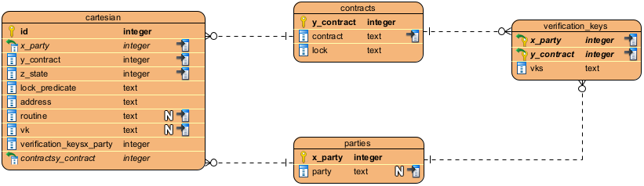

<pre>
TIP: 4
Title: Wallet
Author: Edmundo López Bóbeda <e.lopez@topl.me>
Status: Draft
Type: Standard
Created: 2023-08-08
License: CC-BY-4.0
</pre>

## Abstract

TODO

## Motivation

TODO

## Specification

#### Database Schema

##### `cartesian`

This table represents the Cartesian indexing.

| Field          | Type    | Description                                                  |
| -------------- | ------- | ------------------------------------------------------------ |
| id             | Integer | Identifier of the row.                                       |
| x_party        | Integer | The x-index of the cartesian indexing. Represents the index of the party. |
| y_contract     | Integer | The y-index of the cartesian indexing. Represents the index of the contract. |
| z_state        | Integer | The z-index of the cartesian indexing. Represents the current state of the protocol described by both the party and the contract. |
| lock_predicate | text    | The Lock Predicate serialized using protobuf and then encoded in Base58. |
| address        | text    | The address encoded as described in TIP-0002.                |
| routine        | text    | The routine used for signing. Currently, the only possible value is ExtendedEd25519. |
| vk             | text    | The Verification Key of the user in this coordinates. It can be obtained by deriving the main key using the coordinates in this row. |

##### `parties`

The table contains the list of parties. The wallet reserves the index 0 for the `noparty` party. The `noparty` party is used for contracts that have no party associated with them, for example, a simple height lock. The wallet also reserves the index 1 for the `self` party, which is the default owner of the wallet.

| Field   | Type    | Description                                                  |
| ------- | ------- | ------------------------------------------------------------ |
| x_party | Integer | The x-index of the cartesian indexing. Represents the index of the party. This is the index of this table. |
| party   | Text    | The identifier that identifiers the party.                   |

##### `contracts`

The table contains the list of contracts. The wallet reserves the index 1 for the "default" contract. This contract represents the following lock `threshold(1, sign(0))`.  This is the standard contract where the users of the wallet store their funds.

| Field      | Type    | Description                                                  |
| ---------- | ------- | ------------------------------------------------------------ |
| y_contract | Integer | The y-index of the cartesian indexing. Represents the index of the contract. This is the index of this table. |
| contract   | Text    | The identifier that identifies a contract.                   |
| lock       | Text    | The lock template of this contract, serialized in JSON format. |

##### `verification_keys`

The table contains the list of verification keys of parties. It maps a pair of party and contract to a list of verification keys. This 

|   Field    | Type    | Description                                                  |
| :--------: | ------- | ------------------------------------------------------------ |
|  x_party   | Integer | The x-index of the cartesian indexing. Represents the index of the party. |
| y_contract | Text    | The y-index of the cartesian indexing. Represents the index of the contract. |
|    vks     | Text    | A list of verification keys in JSON format. Each verification key is serialized using protobuf spec and then encoded in Base58. |

## Backwards Compatibility

The new wallet is not compatible with the Dion wallet.

## Copyright

We license this work under a [Creative Commons Attribution 4.0 International License](https://creativecommons.org/licenses/by/4.0/).

